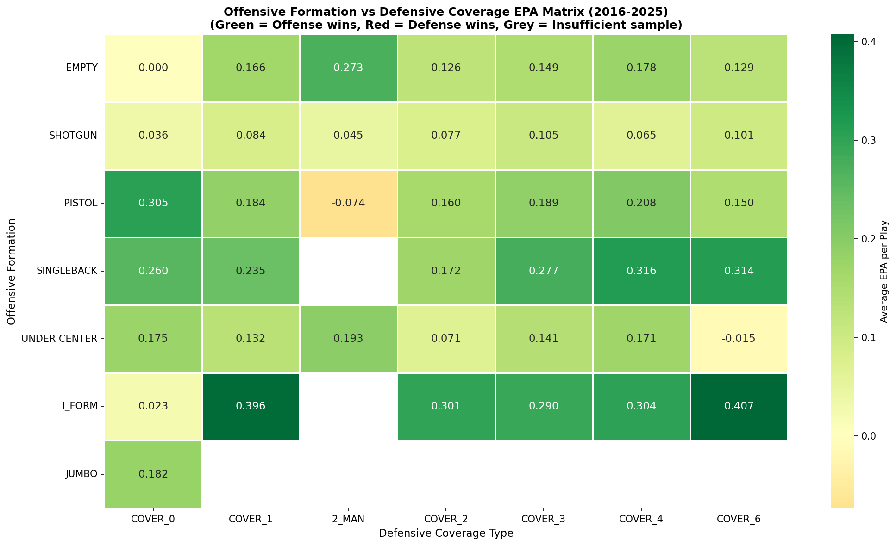
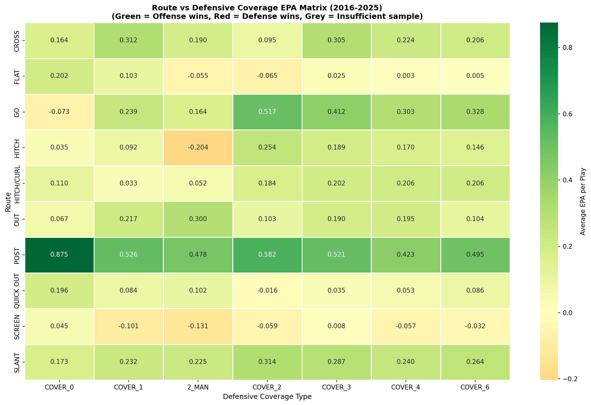
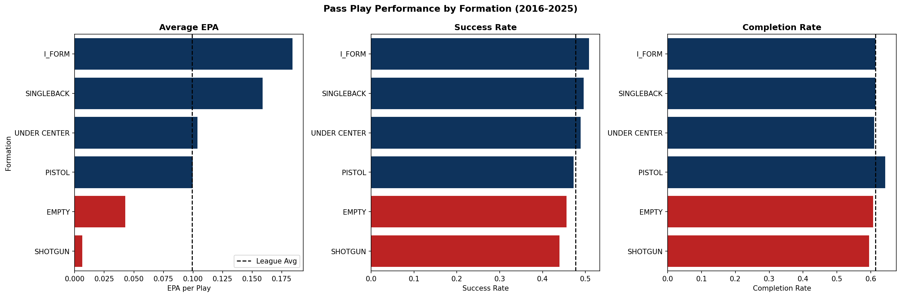
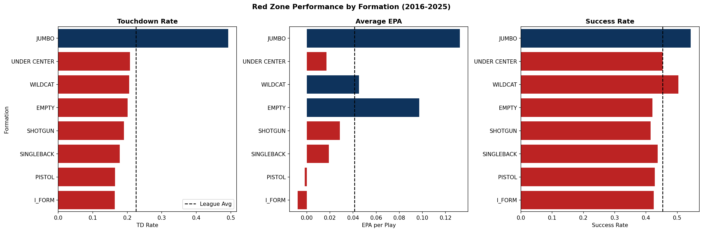
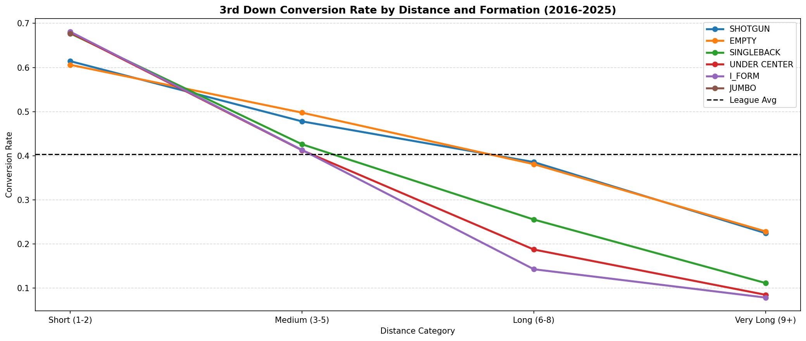

# NFL Formation Analysis

## Overview
This project analyzes offensive formation and personnel matchups across all NFL situations from 2016-2025. Using play-by-play data from nflverse and EPA as the primary evaluation metric, we identify which offensive formations and personnel packages perform best against specific defensive alignments across all downs, distances, and game situations. The project culminates in a detailed case study of the Seattle Seahawks vs Los Angeles Rams 2025 series including their playoff matchup.

## Key Findings
- **I-Form generates +0.184 EPA on pass plays** — nearly 30x more than Shotgun, driven by play action effectiveness, yet Shotgun is used on 70% of pass plays
- **Shotgun converts 3rd down at only 38%** despite being used on 77% of 3rd down plays — the most systemic inefficiency found in this project
- **Post routes are universally dominant** — never below +0.423 EPA against any coverage type, peaking at +0.875 against Cover 0 blitz
- **Screens are the most overused underperforming route** — negative EPA against most coverage types yet called frequently across the league
- **Jumbo formation scores touchdowns on 49% of red zone plays** — more than double the league average of 22%, yet used on only 3% of red zone snaps
- **22 personnel vs Cover 1 generates +0.730 EPA in the red zone** — the highest value matchup in the entire project
- **13 personnel crushes Cover 0 blitz (+0.341 EPA)** — three tight ends provide maximum protection while most teams use empty sets against pressure
- **Cover 4 is the best 3rd down defensive coverage** — allowing only 32% conversion yet Cover 1 is used most frequently despite being the worst performing coverage
- **Pressure creates a 0.406 EPA swing per play** — generating pass rush is more valuable than any coverage scheme or formation matchup
- **The Rams improved from -0.174 to +0.319 EPA across the 2025 SEA series** — a textbook example of in-season formation adjustment

## Methodology
- **Data source:** nfl_data_py / nflverse (play-by-play, 2016-2025)
- **Dataset:** 344,813 pass and run plays across 10 seasons
- **Primary metric:** EPA (Expected Points Added) per play
- **Secondary metrics:** success rate, conversion rate, touchdown rate, completion rate
- **Formation data:** offense_formation, offense_personnel, defense_coverage_type, defense_man_zone_type, defenders_in_box, route

## Repo Structure
'''nfl-formation-analysis/
├── data/
│   ├── raw/              # Raw play-by-play parquet files (not tracked)
│   └── processed/        # Full dataset (not tracked)
├── notebooks/
│   ├── 01_data_exploration.ipynb
│   ├── 02_formation_overview.ipynb
│   ├── 03_offense_vs_defense.ipynb
│   ├── 04_run_game.ipynb
│   ├── 05_pass_game.ipynb
│   ├── 06_red_zone.ipynb
│   ├── 07_third_down.ipynb
│   └── 08_team_analysis.ipynb
├── outputs/
│   └── figures/
├── src/
├── requirements.txt
└── README.md'''
## How to Run
1. Clone the repo
2. Install dependencies: `pip install -r requirements.txt`
3. Run notebooks in order: `01 → 08`
4. Data downloads automatically in notebook 01

## Visualizations Preview

## Data Source
Play-by-play data pulled via [nfl_data_py](https://github.com/nflverse/nfl_data_py) — credit to the nflverse contributors.
